# Functions.do Architecture Overview

This document provides a comprehensive overview of the Functions.do platform architecture, including request flows, the 4-tier cascade system, storage layers, and Worker/Durable Object architecture.

## Table of Contents

1. [High-Level Architecture](#high-level-architecture)
2. [Request Flow](#request-flow)
   - [Deploy Flow](#deploy-flow)
   - [Invoke Flow](#invoke-flow)
3. [4-Tier Cascade System](#4-tier-cascade-system)
4. [Storage Layers](#storage-layers)
5. [Worker/Durable Object Architecture](#workerdurable-object-architecture)
6. [Distributed Runtime Architecture](#distributed-runtime-architecture)

---

## High-Level Architecture

Functions.do is a serverless function platform built on Cloudflare Workers that supports multiple programming languages (TypeScript, Rust, Python, Go, C#, Zig, AssemblyScript) with zero cold starts through a distributed runtime architecture.

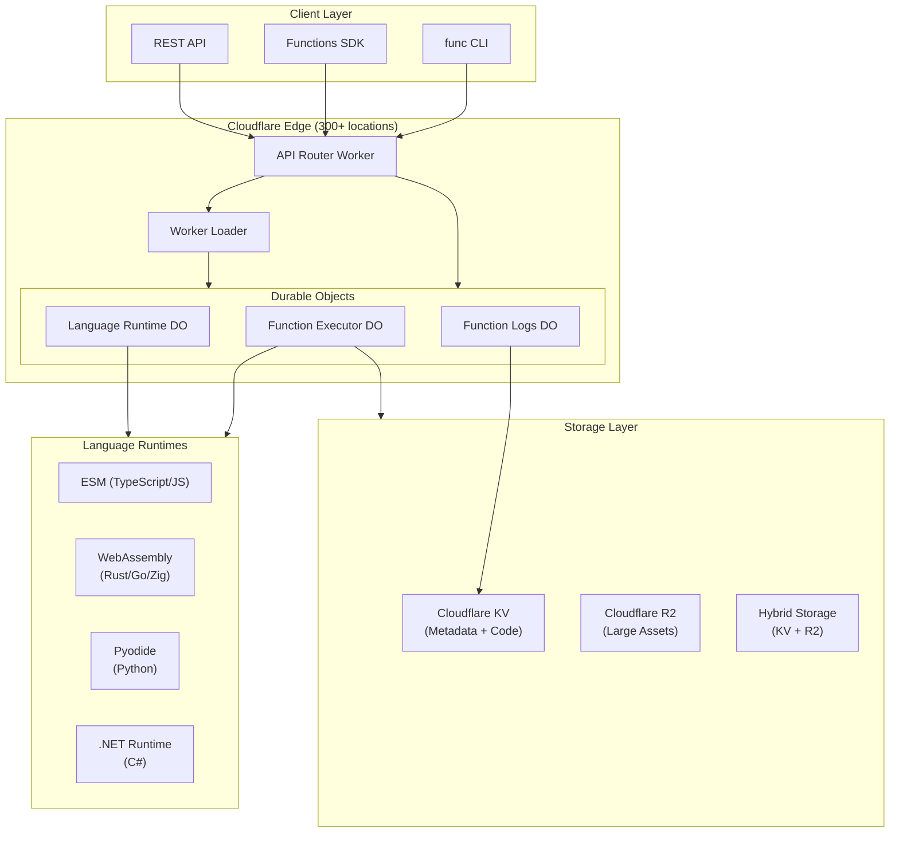

---

## Request Flow

### Deploy Flow

The deploy flow handles function deployment including compilation, storage, and registration.

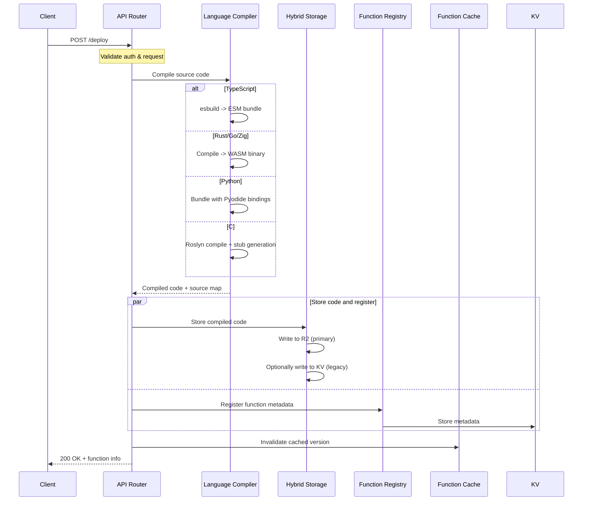

### Invoke Flow

The invoke flow handles function execution with the cascade system for intelligent escalation.

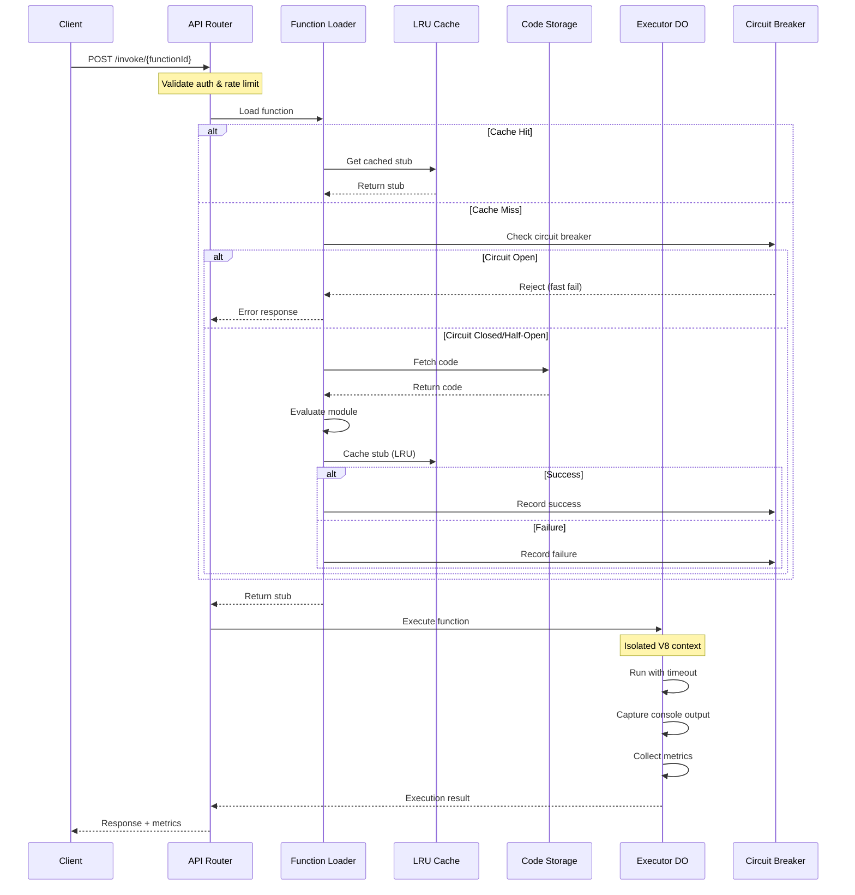

---

## 4-Tier Cascade System

The cascade system provides automatic escalation through tiers of increasing capability, ensuring reliable execution even when simpler approaches fail.

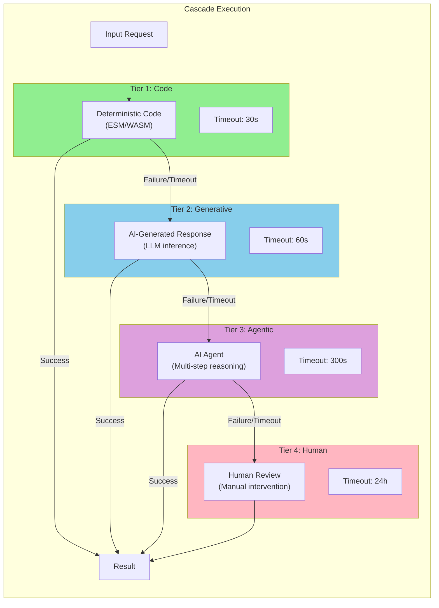

### Cascade Execution Details

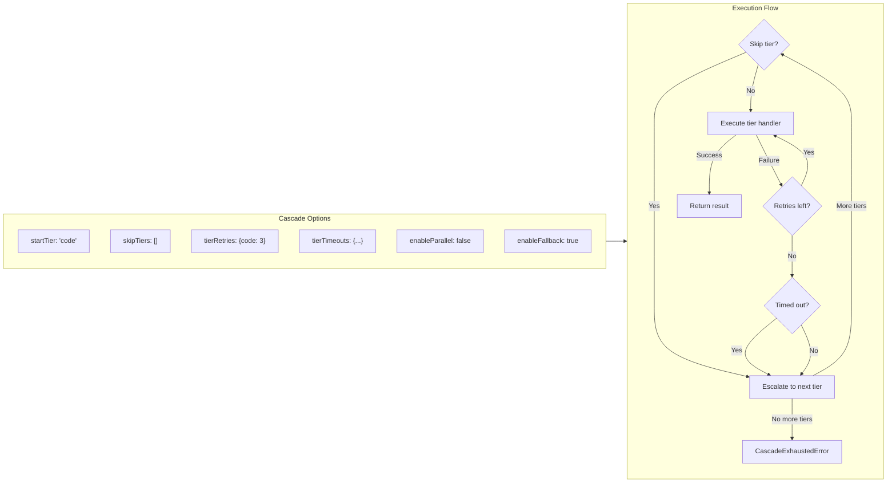

---

## Storage Layers

Functions.do uses a hybrid storage architecture that leverages both Cloudflare KV and R2 for optimal performance and cost efficiency.

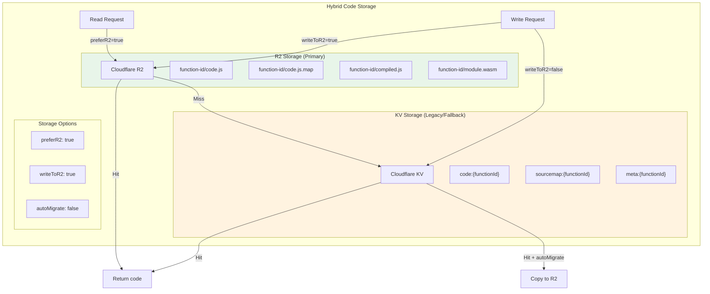

### Storage Migration Flow

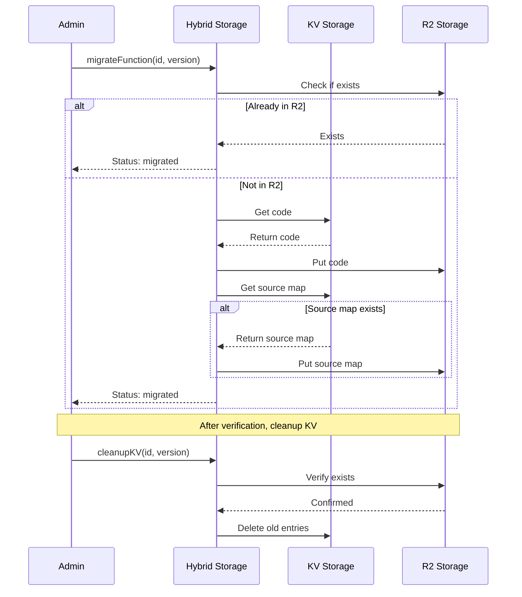

---

## Worker/Durable Object Architecture

The platform uses Cloudflare Workers for edge routing and Durable Objects for stateful execution with strong consistency.

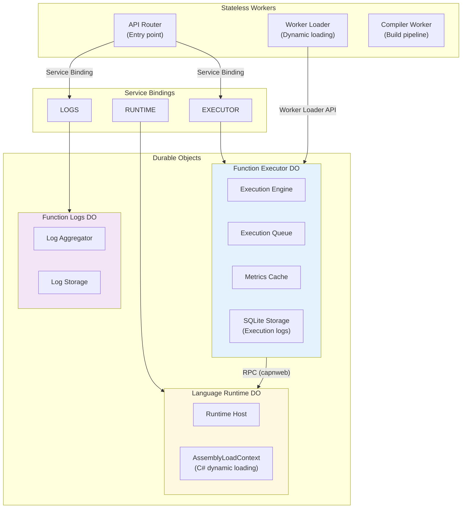

### Function Executor Details

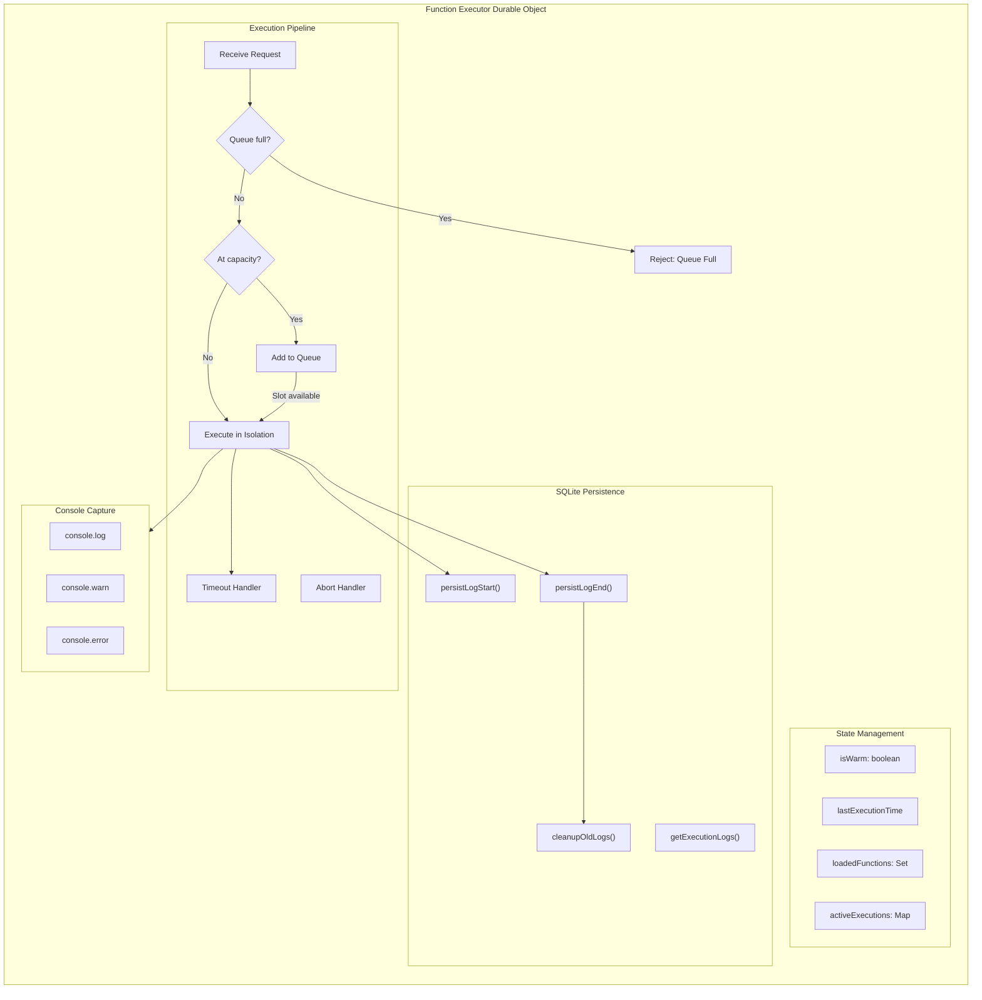

---

## Distributed Runtime Architecture

For heavy runtimes (Python/Pyodide, .NET, JVM), Functions.do uses a distributed architecture with thin stubs and shared runtime workers.

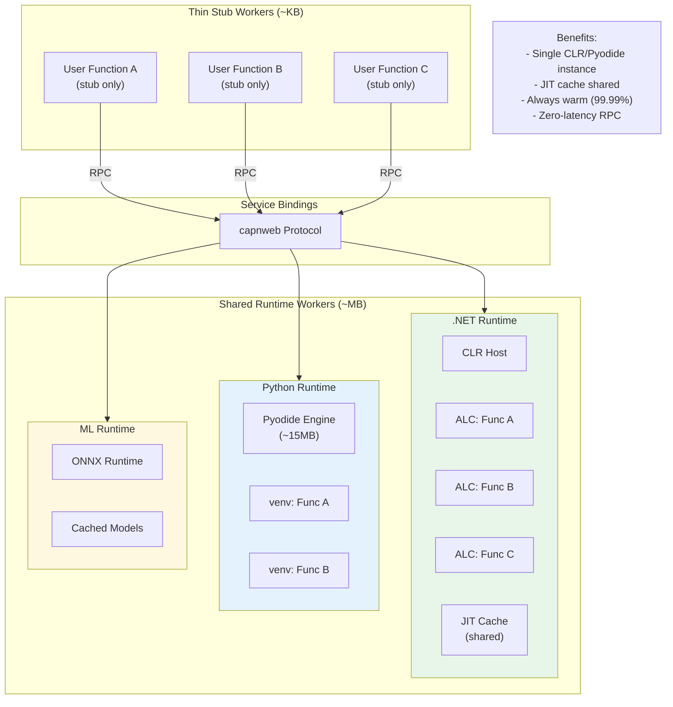

### RPC Communication Pattern

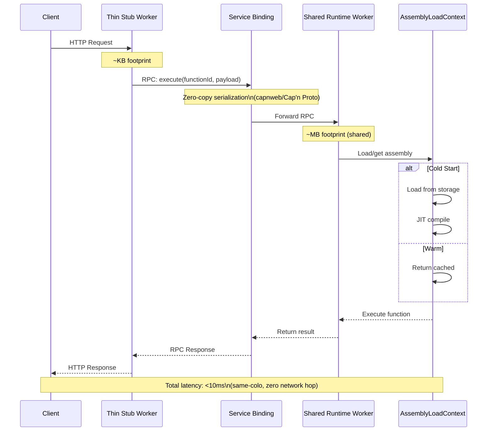

---

## Performance Characteristics

| Component | Latency | Cold Start | Memory |
|-----------|---------|------------|--------|
| ESM (TypeScript) | <5ms | Instant | <50KB |
| WASM (Rust) | <10ms | <10ms | 10-50KB |
| WASM (Go) | <50ms | <50ms | 100KB-2MB |
| Pyodide (Python) | ~100ms | ~1s* | ~15MB |
| .NET (C#) | <50ms | <100ms* | Shared |

*With distributed runtime architecture, cold starts are rare (99.99% warm)

---

## Related Documentation

- [Getting Started](../getting-started.md)
- [API Reference](../api-reference.md)
- [Language Guides](../guides/languages/index.md)
- [Worker RPC Latency Spike](../spikes/worker-rpc-latency.md)
- [WASM Binary Deployment](../spikes/wasm-binary-deployment.md)
- [Capnweb RPC Integration](../spikes/capnweb-rpctarget-worker-loader.md)
- [.NET Shared Runtime](../spikes/dotnet-shared-runtime.md)
