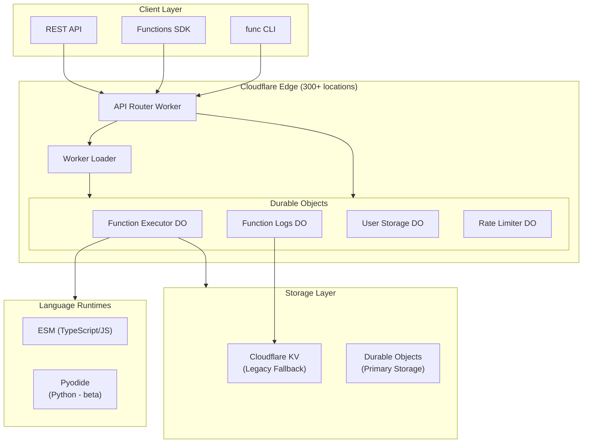
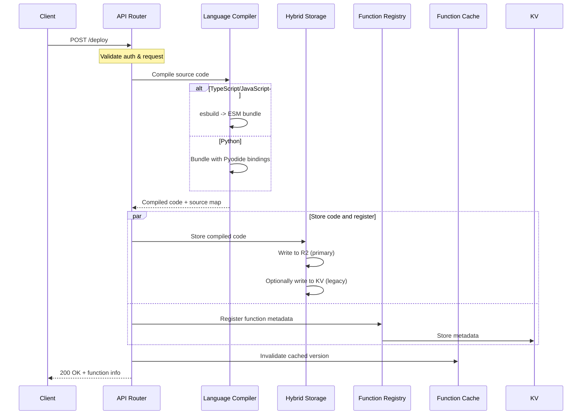
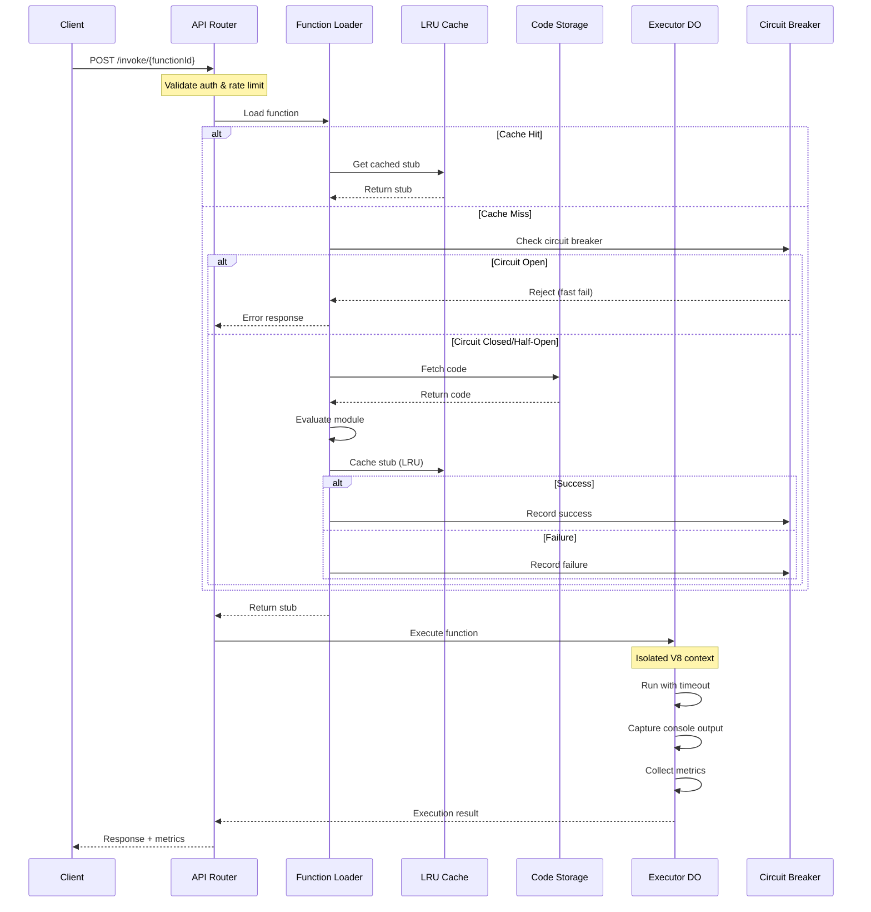
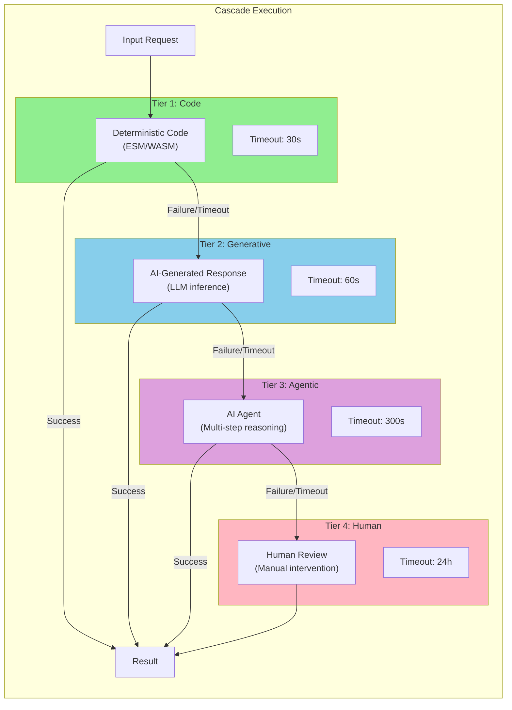
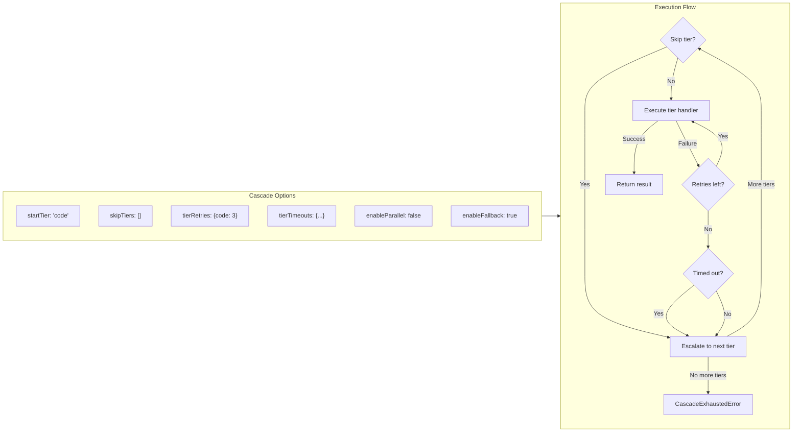
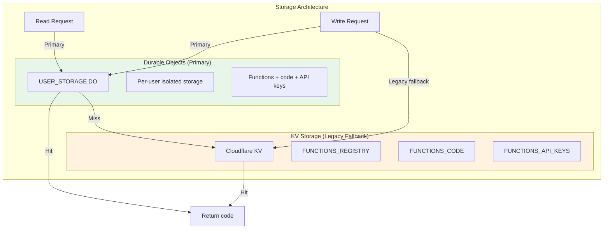
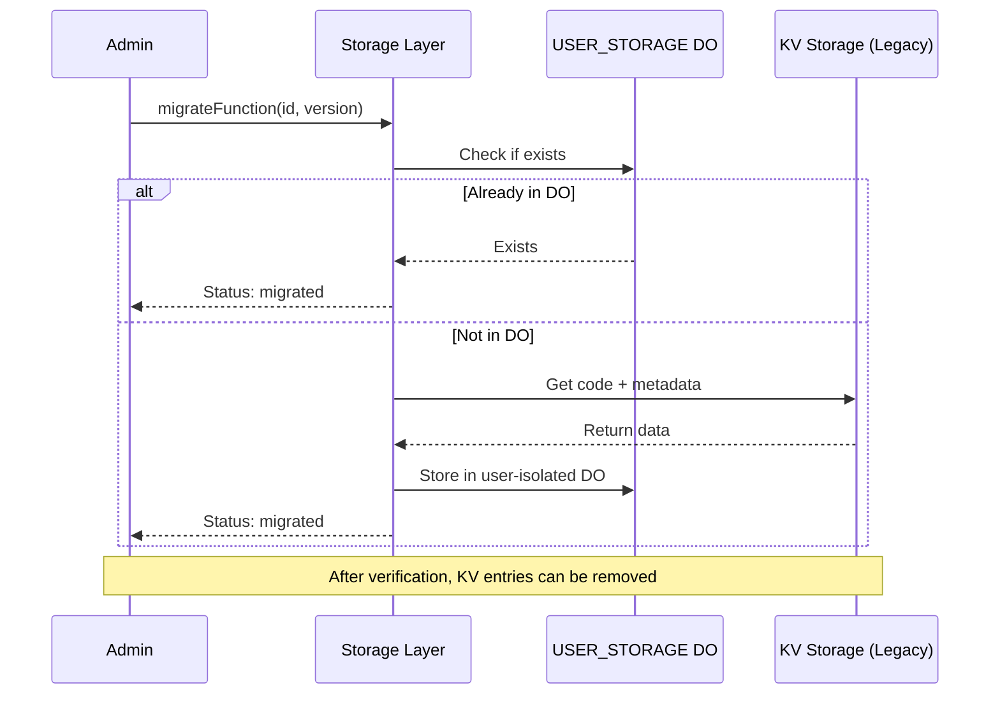
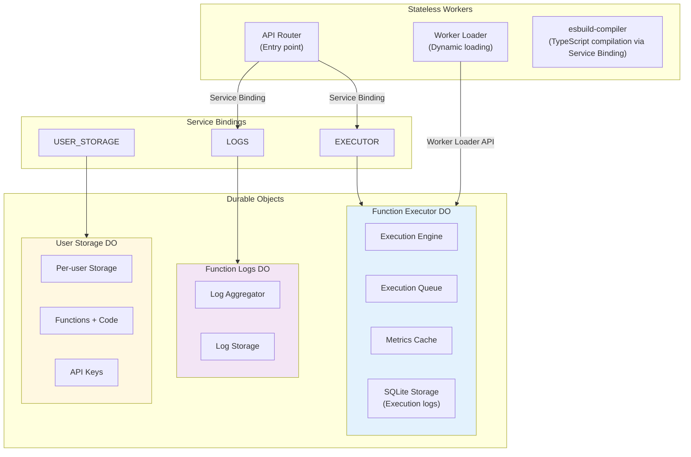
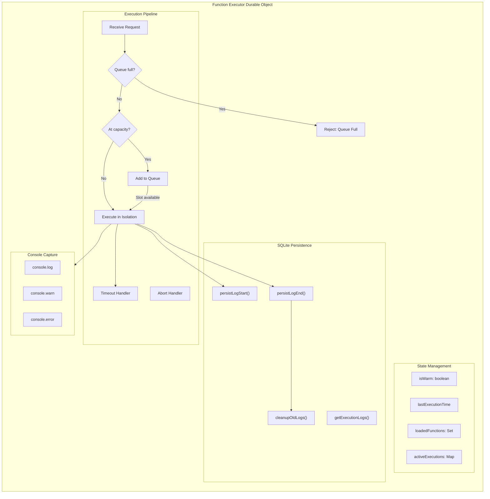
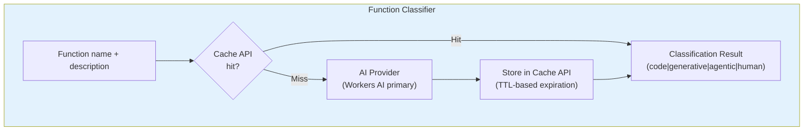

# Functions.do Architecture Overview

This document provides a comprehensive overview of the Functions.do platform architecture, including request flows, the 4-tier cascade system, storage layers, and Worker/Durable Object architecture.

## Table of Contents

1. [High-Level Architecture](#high-level-architecture)
2. [Request Flow](#request-flow)
   - [Deploy Flow](#deploy-flow)
   - [Invoke Flow](#invoke-flow)
3. [4-Tier Cascade System](#4-tier-cascade-system)
4. [Storage Layers](#storage-layers)
5. [Worker/Durable Object Architecture](#workerdurable-object-architecture)
6. [Classifier Architecture](#classifier-architecture)

---

## High-Level Architecture

Functions.do is a serverless function platform built on Cloudflare Workers that supports TypeScript, JavaScript, and Python (beta) with a 4-tier cascade execution system. The platform uses Durable Objects for storage (with KV fallback), Cache API-based classifier caching, and a unified Env type defined at `src/core/env.ts`.

---

## Request Flow

### Deploy Flow

The deploy flow handles function deployment including compilation, storage, and registration.

### Invoke Flow

The invoke flow handles function execution with the cascade system for intelligent escalation.

---

## 4-Tier Cascade System

The cascade system provides automatic escalation through tiers of increasing capability, ensuring reliable execution even when simpler approaches fail.

### Cascade Execution Details

---

## Storage Layers

Functions.do uses Durable Objects (USER_STORAGE) as the primary storage layer, with KV namespaces as a legacy fallback during migration. The unified Env type at `src/core/env.ts` defines all storage bindings.

### Storage Migration Flow (KV to Durable Objects)

---

## Worker/Durable Object Architecture

The platform uses Cloudflare Workers for edge routing and Durable Objects for stateful execution with strong consistency.

### Function Executor Details

---

## Classifier Architecture

The function classifier uses AI to determine which cascade tier should handle a given function invocation. Classification results are cached using Cloudflare's Cache API for cross-request, cross-isolate caching.

### AI Provider Fallback Chain

The classifier supports multiple AI providers with automatic fallback:
1. Cloudflare Workers AI (primary, via binding)
2. OpenRouter
3. Anthropic
4. OpenAI
5. AWS Bedrock

---

## Performance Characteristics

| Component | Latency | Cold Start | Memory |
|-----------|---------|------------|--------|
| ESM (TypeScript/JS) | <5ms | Instant | <50KB |
| Pyodide (Python) | ~100ms | ~1s | ~15MB |

---

## Key Implementation Files

- **Unified Env type**: `src/core/env.ts` - Single source of truth for all Cloudflare Worker bindings
- **Function Classifier**: `src/core/function-classifier.ts` - Cache API-based AI classifier with multi-provider fallback
- **API Router**: `src/api/router.ts` - Request routing with cascade execution support
- **Default invoke path**: Cascade execution (`/v1/cascade/:id`)

## Related Documentation

- [Getting Started](../getting-started.md)
- [API Reference](../api-reference.md)
- [Language Guides](../guides/languages/index.md)
